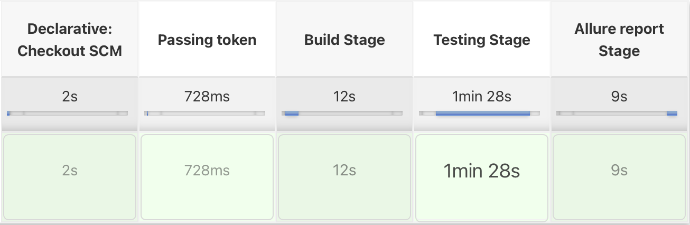

# Java-Selenide-RestAssured-BDD

### About
**Overview:** _Java UI and API with BDD testing framework sample._

**Systems under test:**
- UI: Oracle login application.
- API: Gorest.co.in Rest and GraphQL application.

**Technology stack:**
- Basic: Java 8, Maven, TestNG
- BDD: Cucumber
- UI: Selenide
- API: Rest Assured
- Reporting: Allure

## Locally on your machine
### Installation
1. Install [Java 8](https://www.oracle.com/java/technologies/javase/javase8-archive-downloads.html)
2. Export JAVA_HOME to environment [Link for Mac](https://stackoverflow.com/questions/15826202/where-is-java-installed-on-mac-os-x)
3. Install [Maven](https://maven.apache.org/install.html)
4. Download the project.
5. Install maven dependencies in pom.xml file.
6. Get your token for [GoRest](https://gorest.co.in/my-account/access-tokens) (You need to register/login first).
7. In the project's root folder, paste your token into `token.json` file as a value for the `token` key.
8. Optionally: You can install `Cucumber` plugIn for Idea. It allows you to start tests separately from IDE.

### Running tests
1. You can run tests using BaseTest file in the `src/test/java/tests` folder.
2. As well, you can do it using features files in the `src/test/java/features`.
3. And you can also do it with command line with a single command `mvn test`.
4. Finally, you can start tests using tags. List of available tags: @ui, @api, @rest, @gql. You need to specify one of these tags in the command `mvn clean test -D"cucumber.filter.tags=@***"`. Instead of `***` paste chosen tag.

### After test
- Framework creates allure reports, that located in `allure-results` folder.
- To get the report in the HTML format, type `allure serve allure-results` into the terminal in the project's root folder.
- For failed tests framework makes `screenshots`, that could be found in generated allure report in the `after` step hook.
- **Note: Allure folder would be cleared within the next test run.**

## Jenkins CI
### Installation
1. Install [Jenkins](https://www.jenkins.io).
2. Install default plugins in Jenkins.
3. As well there is a list of plugins that you need to install additionally via Jenkins > Manage Jenkins > Manage Plugins: Allure Jenkins Plugin, Git Plugin, GitHub plugin, HTML Publisher plugin, Maven Integration plugin, Pipeline Maven Integration Plugin.
4. In Jenkins > Manage Jenkins > Global Tool Configuration click on `Maven installations...` button in `Maven` section and add name `maven`, choose last version. Then apply and save.
5. Create a new Job with `Pipeline` type.
6. Job configuration:
- Enable `GitHub Project` checkbox and paste my project's git url
- Enable `This project is parameterised` checkbox and add a String parameter named `token`, it is important!
- Scroll down to the Pipeline section and choose `Pipeline script from SCM`, then choose Git as an option.
- Paste my project's url to the repo's url field: `https://github.com/artgrtmnk/Java-Selenide-RestAssured-BDD/` and specify the branch name a bit lower as: `*/main`.
- Apply and Save the pipeline.

### Running tests
1. Click on `Build with Parameters` in the left nav menu.
2. Paste your GoRest token into the token var field.
3. Click `Build` button

### After test
- Allure report would be generated automatically. The only thing you need to do is to click on `Allure Report` button in the left nav menu.
- **Note: Allure folder would be cleared within the next test run.**

## Post scriptum
**_Antipattern was used in this sample framework: Test scenarios from API feature files are running sequentially, just because that's a sample. Never do it in a real project. Each test scenario should be independent and all of the pre-conditions should be done within the Given steps!_**
